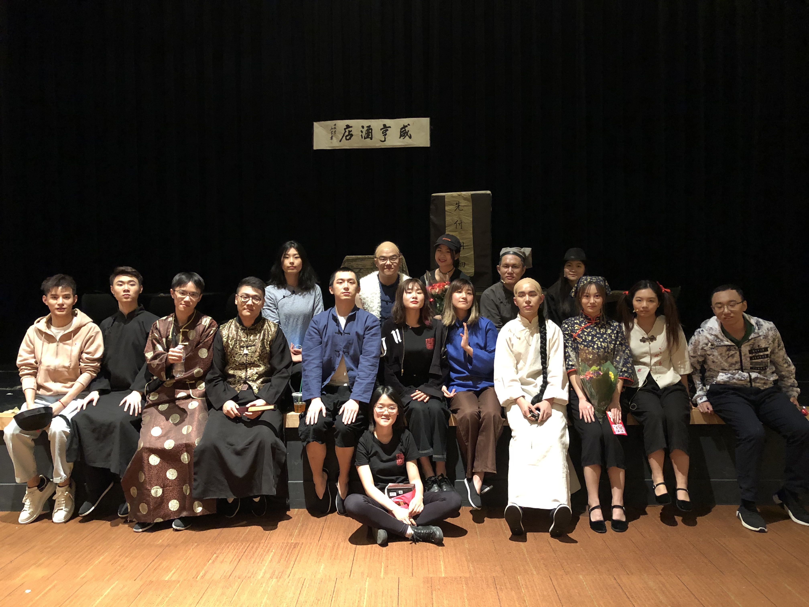
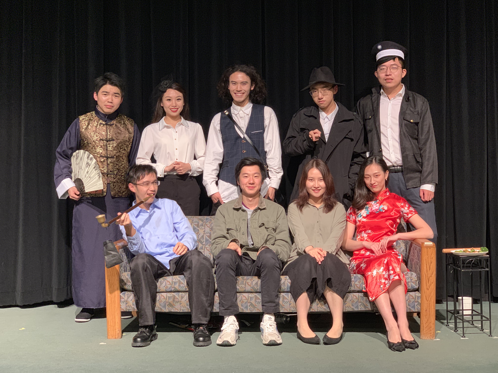

I love drama. I read a lot of drama scripts, and acted in a few stage plays. While acting like others, I can experience a different life, which often inspires a lot.

These are some of the stage plays I acted in.

* **Americal Love Story**

A touching story about young men and women struggling to survive in America and looking for true love

* **Kong Yiji (孔乙己)**

Adapted from Lu xun (鲁迅)'s famous novel Kong Yiji. The play reflects the human nature in old China.

* **Monkeys (群猴)**

An ironic story mocking an election compaign in old China.

