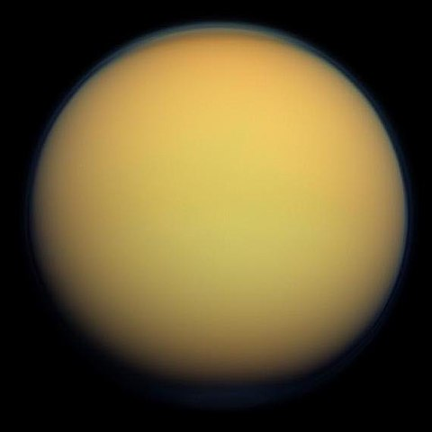

[Titan](https://en.wikipedia.org/wiki/Titan_(moon)) is the largest moon of Saturn, and also the second-largest moon in the solar system after Jupiter's moon, Ganymede. Titan is 50% larger than Earth's moon, and larger than the smallest planet in our solar system, Mercury. In addition, Titan is the only known moon with a dense atmosphere and the only known celestial body that posseses surface liquid other than Earth. Such characteristics make it one of the most interesting bodies in our solar system that people are eager to explore.

Titan           |  Cassini-Huygens Mission
:-------------------------:|:-------------------------:
  |  

The [Cassini-Huygens mission](https://en.wikipedia.org/wiki/Cassini–Huygens) was aimed to study Saturn and its planetary system. The spacecraft comprised a orbiter, Cassini, and a lander, Huygens, which is named after Titan's discoverer. The Cassini orbiter made multiple close flybys of Titan, and measured Titan's atmosphere composition at different heights with INMS (Ion and Neutral Mass Spectrometer). That's where our data come from.

The [exosphere](https://en.wikipedia.org/wiki/Exosphere) is a volume surrounding a body where molecules are gravitationally bound, but where the density is two low for them to collide. The above figure shows the bottom of Titan's exosphere is about 2000 kilometes from the surface (Titan's radius is about 2500km), where the slope of H2's density decreases abruptly. This is because the molecules in the exosphere no more experience the barometric pressure. In this figure we plot the median of H2 density within each height segment, and in different sector areas with respect to Saturn. One interesting phenomenon is that the H2 density in the "F" sector, namely the one-fourth area ahead Titan's revolution around Saturn, is significantly higher than other areas. We thougt this may be due to the perturbation of Saturn.

To prove that, we did a Monte-Carlo simulation for hypothetical H2 molecules around Titan. The model is simply a restricted three-body problem including molecules, Titan and Saturn. The initial velocity of molecules must satisfy Maxwell distribution, plus a wind speed on Titan's surface as high as 100m/s. The upper boundary of the model is the hill sphere of Titan, beyond which the molecules are no longer bound by Titan. Below is a simulation of the emission of 10,000 molecules from the surface of Titan, viewed from the north pole of Titan. Saturn resides somewhere to the right. Unfortunately, no significant difference was observed between areas in the four directions.


<!-- <video width="320" controls style="display: block; width: 50%; margin: auto">
    <source src="{{ 'assets/images/Animate_10000p-2D.mp4' | relative_url }}" type="video/mp4">
</video> -->

Detailed analysis could also be done by detecting the velocity distributions of molecules in different areas. Below is a animation of the change of the velocity distributions during emission. Again, no signicant difference was observed.


<!-- <video width="320" controls style="display: block; width: 50%; margin: auto">
    <source src="{{ 'assets/images/Animate_velocity.mp4' | relative_url }}" type="video/mp4">
</video> -->
 
